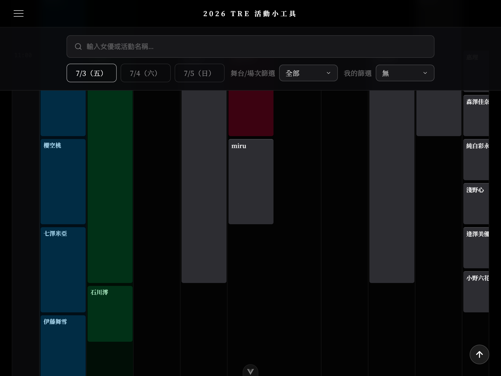
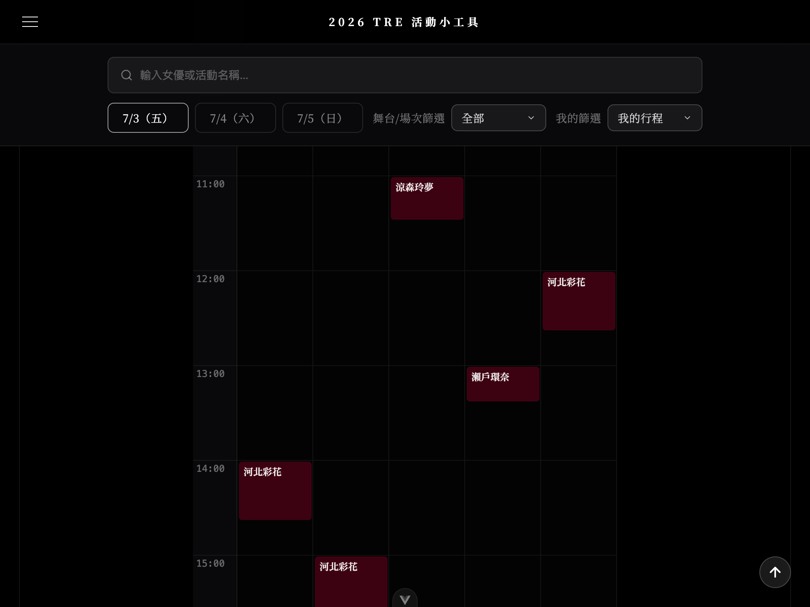
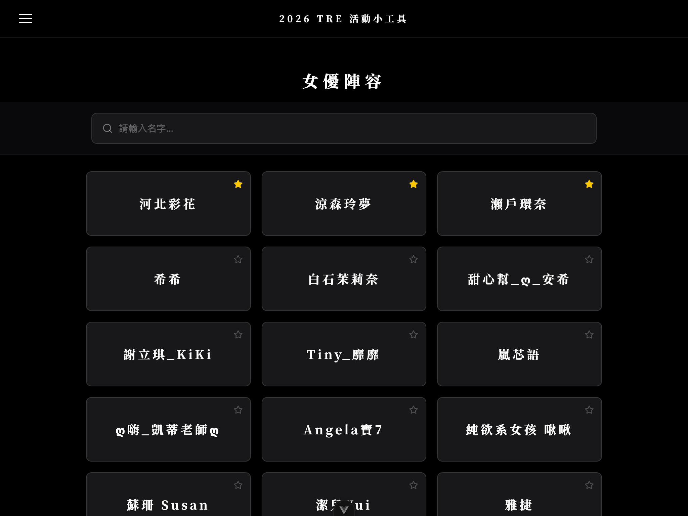
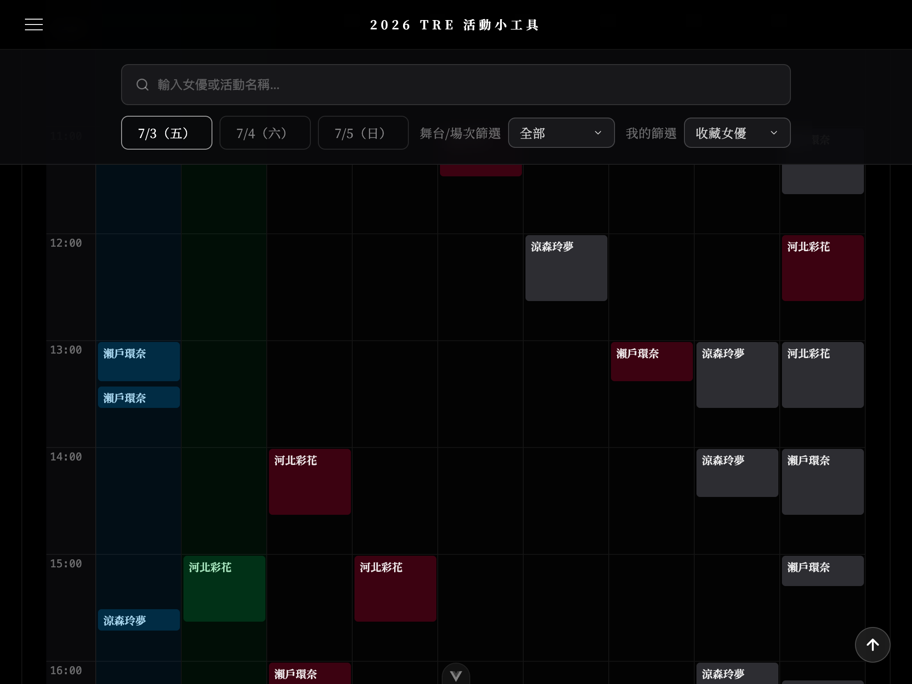

# 2026 TRE 活動小工具

2026 台北國際紅人展（TRE）的行程規劃小工具，提供：

- **場次行事曆**：以時間軸呈現所有活動場次與舞台，三天資料一覽
- **女優陣容**：瀏覽全部參展女優，加入收藏後可快速篩選
- **我的行程**：將感興趣的場次加入收藏，用「我的行程」篩選出個人排程
- **收藏女優**：收藏喜愛女優，以「收藏女優」篩選快速找出她們的全部場次
- **攤位資訊**：各攤位位置與相關資訊

資料來源皆為官方網站（JKFace.net）爬取，一切以官方公告為主

## 畫面截圖

### 行事曆總覽——多活動、高密度

行事曆以欄位方式並排所有活動，同時段多場次自動堆疊，可橫向捲動瀏覽



### 我的行程——篩選收藏場次

將感興趣的場次加入收藏後，切換「我的篩選 → 我的行程」，即可只顯示自己預計參加的場次，時間一目了然



### 女優收藏——加入最愛與篩選

在女優陣容頁點擊星星加入收藏，收藏女優自動置頂



切換「我的篩選 → 收藏女優」，行事曆只顯示這些女優的場次



## 資料格式說明（`src/data/`）

### `artists.json`

女優基本資料

```json
[
  {
    "id": 5564317,
    "name": "明里紬" // 女優名稱
  }
]
```

### `events.json`

活動清單，每個 event 代表一個票種或活動項目（e.g., VIP 簽名會、握手會）

```json
[
  {
    "id": 282,
    "name": "2026TRE台北國際紅人展", // 活動名稱
    "artistIds": [5675902, 5846923] // 參與女優的 artist ID 列表
  }
]
```

### `sessions.json`

各活動的具體場次時刻，一筆資料對應一個時間段

```json
[
  {
    "id": 6352,
    "eventId": 290, // 所屬活動 ID，對應 events.json 的 id
    "artistIds": [5845129], // 此場次參與女優的 artist ID 列表
    "time": "2026/07/03 13:00", // 場次開始時間，格式 YYYY/MM/DD HH:mm
    "title": "2026/07/03 13:00-13:40    神木麗" // 完整場次說明，含時段與女優名
  }
]
```
